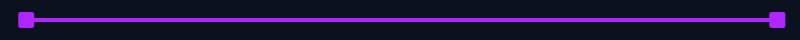

  <kbd>
    <picture>
      <source media="(prefers-color-scheme: dark)" srcset="https://raw.githubusercontent.com/nanabytz/nanabytz/main/dark.svg?v=20">
      <source media="(prefers-color-scheme: light)" srcset="https://raw.githubusercontent.com/nanabytz/nanabytz/main/light.svg?v=20">
      
    </picture>
  </kbd>

  <picture>
    <source media="(prefers-color-scheme: light)" srcset="divider-light.gif">
    
  </picture>

  <kbd>
    
  </kbd>
    
  <kbd>
    
  </kbd>
  &nbsp;
  <kbd>
    
  </kbd>

  <picture>
    <source media="(prefers-color-scheme: light)" srcset="divider-light.gif">
    
  </picture>

  <!-- Custom Animated Heading -->
  <picture>
    <source media="(prefers-color-scheme: light)" srcset="heading-light.gif" width="250">
    
  </picture> 

  <!-- Badges -->
  <picture>
    <source media="(prefers-color-scheme: light)" srcset="https://img.shields.io/badge/Python-FFFFFF?style=for-the-badge&logo=python&logoColor=0369A1&v=1">
    
  </picture>
  <picture>
    <source media="(prefers-color-scheme: light)" srcset="https://img.shields.io/badge/C-FFFFFF?style=for-the-badge&logo=c&logoColor=0369A1&v=1">
    
  </picture>
  <picture>
    <source media="(prefers-color-scheme: light)" srcset="https://img.shields.io/badge/C%2B%2B-FFFFFF?style=for-the-badge&logo=cplusplus&logoColor=0369A1&v=1">
    
  </picture>
  <picture>
    <source media="(prefers-color-scheme: light)" srcset="https://img.shields.io/badge/HTML5-FFFFFF?style=for-the-badge&logo=html5&logoColor=EA580C&v=1">
    
  </picture>
  <picture>
    <source media="(prefers-color-scheme: light)" srcset="https://img.shields.io/badge/CSS3-FFFFFF?style=for-the-badge&logo=css3&logoColor=EA580C&v=1">
    
  </picture>
  <picture>
    <source media="(prefers-color-scheme: light)" srcset="https://img.shields.io/badge/JavaScript-FFFFFF?style=for-the-badge&logo=javascript&logoColor=EA580C&v=1">
    
  </picture>
  <picture>
    <source media="(prefers-color-scheme: light)" srcset="https://img.shields.io/badge/PyCharm-FFFFFF?style=for-the-badge&logo=pycharm&logoColor=7C3AED&v=1">
    
  </picture>
  <picture>
    <source media="(prefers-color-scheme: light)" srcset="https://img.shields.io/badge/VS_Code-FFFFFF?style=for-the-badge&logo=visualstudiocode&logoColor=7C3AED&v=1">
    
  </picture>
  <picture>
    <source media="(prefers-color-scheme: light)" srcset="https://img.shields.io/badge/Git-FFFFFF?style=for-the-badge&logo=git&logoColor=7C3AED&v=1">
    
  </picture>
  <picture>
    <source media="(prefers-color-scheme: light)" srcset="https://img.shields.io/badge/GitHub-FFFFFF?style=for-the-badge&logo=github&logoColor=7C3AED&v=1">
    
  </picture>

  <picture>
    <source media="(prefers-color-scheme: light)" srcset="divider-light.gif">
    
  </picture>

  <kbd>
    <picture>
      <source media="(prefers-color-scheme: dark)" srcset="https://raw.githubusercontent.com/nanabytz/nanabytz/output/github-snake-dark.svg?v=3" />
      <source media="(prefers-color-scheme: light)" srcset="https://raw.githubusercontent.com/nanabytz/nanabytz/output/github-snake.svg?v=3" />
      
    </picture>
  </kbd>

  <picture>
    <source media="(prefers-color-scheme: light)" srcset="divider-light.gif">
    
  </picture>

  
  &nbsp;&nbsp;
  
  &nbsp;&nbsp;
  

  <picture>
    <source media="(prefers-color-scheme: light)" srcset="divider-light.gif">
    
  </picture>

